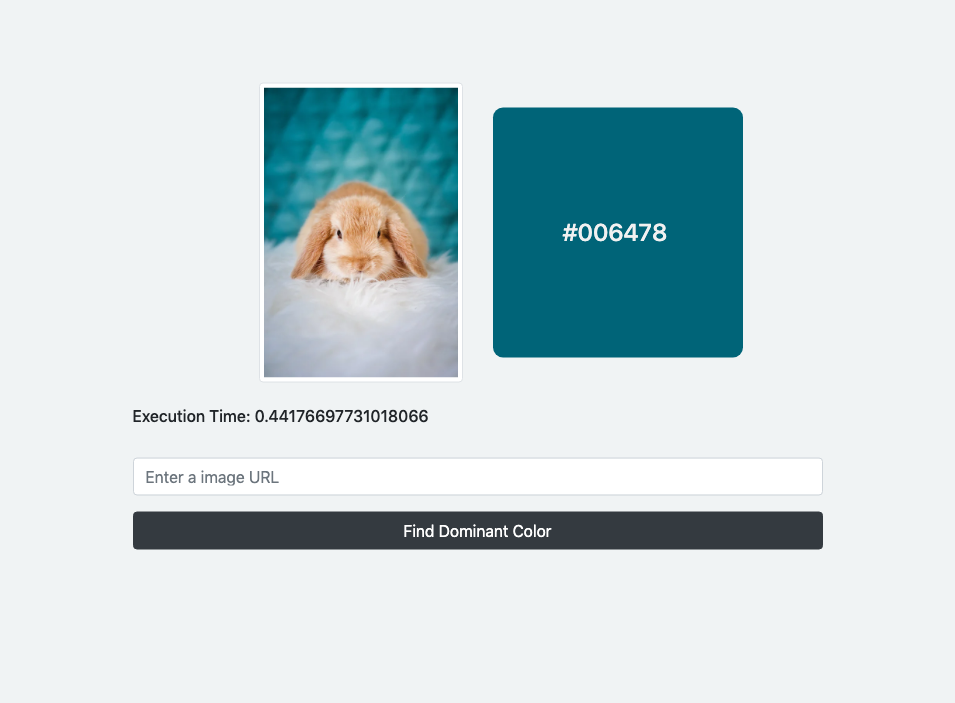
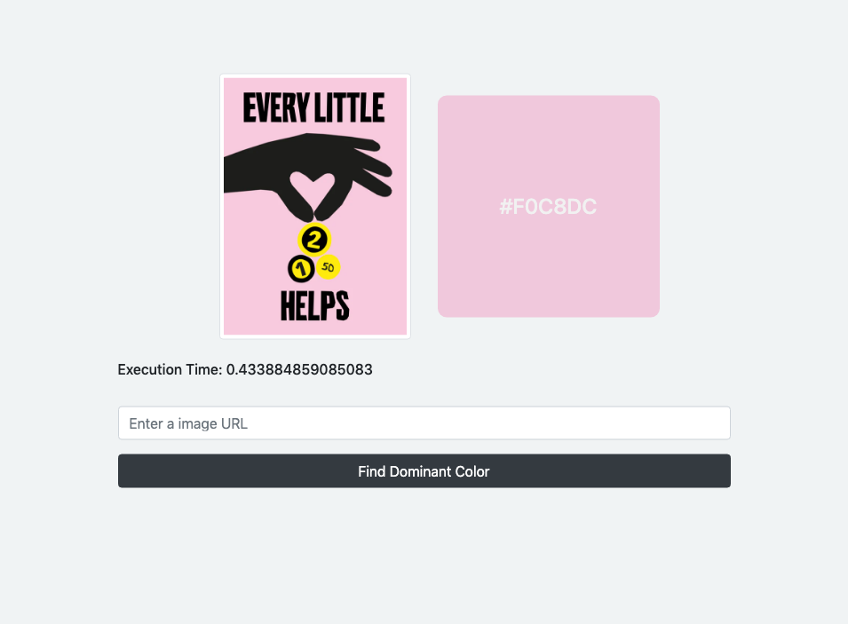
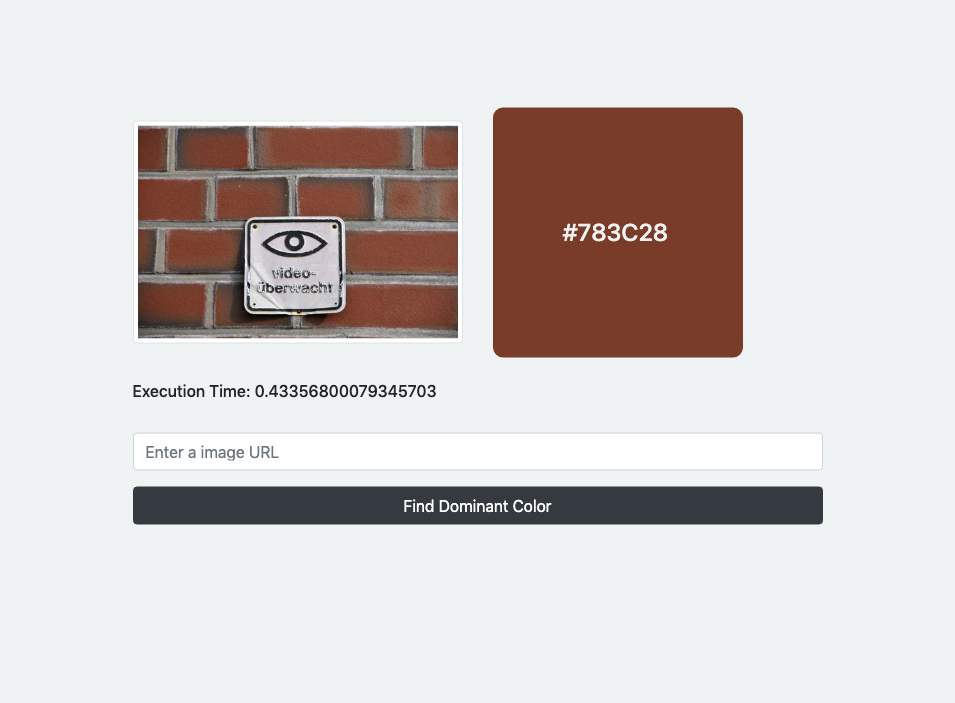
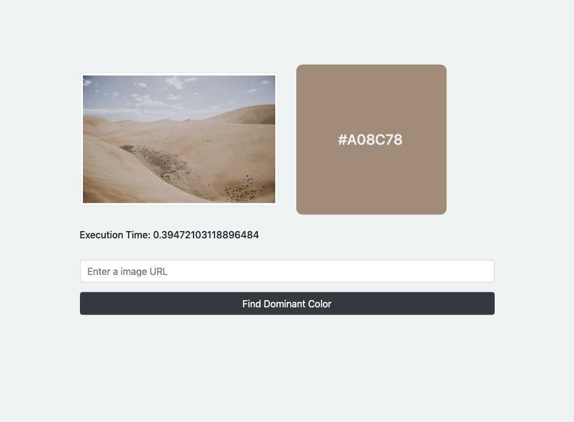

# most-common-color

### The most common color finder in the image with Python

### Screenshots

|  |  |
| :---------------: | :---------------- |
|  |  |

###### It may not be the correct approach, I just asked how to do it
